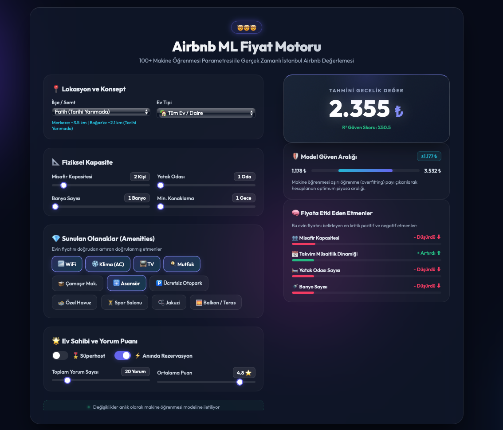

# Explainable Airbnb Price Prediction System for Istanbul (SHAP & Monotonic ML)

An end-to-end machine learning engine that predicts nightly Airbnb rental prices in Istanbul and transparently explains its valuation decisions using **SHAP (SHapley Additive exPlanations)**.

Unlike standard black-box regression models, this application breaks down the exact positive and negative monetary impact of each individual feature (e.g., proximity to the Bosphorus, number of bedrooms, AC availability) on the predicted nightly rate.



## Architecture & Methodology

- **Market Segmentation:** Because entire rental units (*Entire home/apt*) and private rooms (*Private room*) operate under completely different real estate dynamics, two separate `HistGradientBoostingRegressor` models were trained.
- **Monotonic Constraints:** To enforce real-world domain logic and prevent illogical model predictions:
  - Adding premium amenities (Pool, AC, Elevator, Jacuzzi) is constrained to never decrease the predicted price ($+1$).
  - Increasing distance to the Bosphorus shoreline or city center is constrained to never increase location premium ($-1$).
- **Hyperparameter Tuning:** Optimized using **Optuna** over a K-Fold cross-validation strategy.
- **NLP Text Features:** Extracted `TF-IDF` features from listing descriptions to capture unmodeled luxury, scenic, or historical keywords.
- **Real-Time Explainability:** A Flask backend serves predictions alongside live `TreeExplainer` SHAP values rendered as impact bars in the UI dashboard.

## Installation & Usage

Install dependencies:

```bash
pip install flask flask-cors pandas numpy scikit-learn optuna shap joblib
```

Run the application:

```bash
python3 app.py
```

Navigate to `http://localhost:5001` in your browser to test the valuation engine.

## Repository Structure

- `app.py`: Flask backend and real-time SHAP inference API
- `feature_engineering.py`: Haversine distance calculations and amenity Boolean parsers
- `train_optuna.py`: Monotonically constrained Optuna hyperparameter optimization pipeline
- `analyze_model.py`: Residual scatter plots and global SHAP summary generator
- `ui/`: Glassmorphism frontend dashboard (HTML, CSS, JS)

---
*Author:* Onur Yavuz
